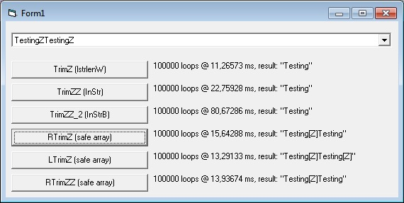



## Valid & fast TrimNull

### Description

While I think these TrimNull functions are a bit silly business, I guess they're mostly used due to lack of understanding of Windows API return values or of the file that is being processed, here you can find proper implementations of the LTrim & RTrim equivalents for NULL characters. Instead of InStr of any kind the string is processed as Integer array, without making a new copy of the string. This allows full control over the validation process and thus string is properly parsed from any NULLs at the end or beginning of a string.

A test program is included for comparison which shows the bugs in other implementations. Also a bit fuzzy logic RTrimZZ is included: it is fast, but it is mostly dedicated to cases where you expect a buffer full of NULL, except for the actual data at the beginning of the string.

The functions are long but fast.

 
### More Info
 

             |
---                |---
**Submitted On**   |2011-01-24 18:30:02
**By**             |[Vesa Piittinen](https://github.com/Planet-Source-Code/PSCIndex/blob/master/ByAuthor/vesa-piittinen.md)
**Level**          |Advanced
**User Rating**    |5.0 (15 globes from 3 users)
**Compatibility**  |VB 5\.0, VB 6\.0
**Category**       |[String Manipulation](https://github.com/Planet-Source-Code/PSCIndex/blob/master/ByCategory/string-manipulation__1-5.md)
**World**          |[Visual Basic](https://github.com/Planet-Source-Code/PSCIndex/blob/master/ByWorld/visual-basic.md)
**Archive File**   |[Valid\_&\_fa2196671242011\.zip](https://github.com/Planet-Source-Code/vesa-piittinen-valid-fast-trimnull__1-73703/archive/master.zip)

